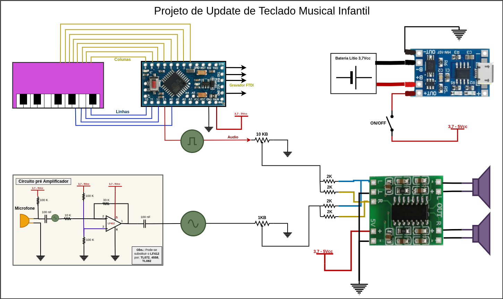

# Projeto Update de Teclado Musical Infantil

Projeto de atualização de teclado infantil utilizando arduino para gerar as notas musicais através da função nativa `tone()`.

# Materiais Utilizados
* [Teclado musical](images/teclado_original.jpg) (carcaça, teclas e microfone).
* Arduino Mini Pro 5v/16Mhz.
* Módulo para carregar bateria de lítio TP4056.
* Bateria de Lítio 3,7V (Uma célula).
* Módulo amplificador stereo 5V/3W.
* Resistores diversos (vide diagrama).
* Capacitores diversos (vide diagrama).
* Amplificador operacional LF412, menos ruidos ou TL072, TL082, RC4558...
* Potenciômetros diversos (vide diagrama).
* Gravador serial [FTDI](images/gravador_ftdi.jpg).

# Plataforma
Para o projeto foi utilizado o editor VSCode com o plugin [PlatformIO](https://platformio.org).

# Diagrama

# Playlist do Projeto

<iframe width="560" height="315" src="https://www.youtube.com/embed/videoseries?list=PL3eeSBG887IMoi00QTnhB3eoNwIQUxrWe" title="YouTube video player" frameborder="0" allow="accelerometer; autoplay; clipboard-write; encrypted-media; gyroscope; picture-in-picture" allowfullscreen></iframe>